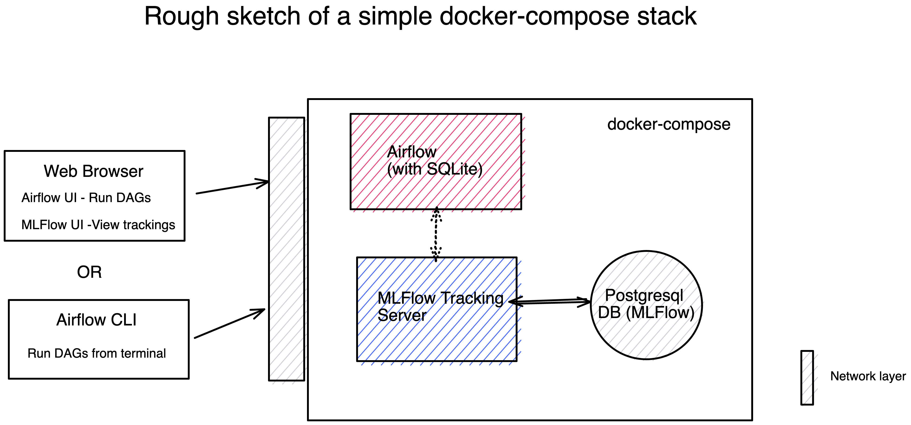
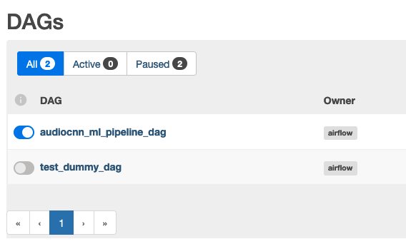
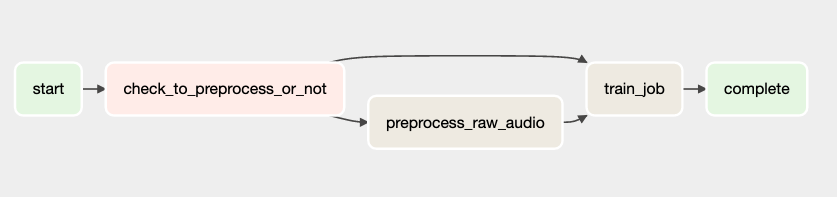
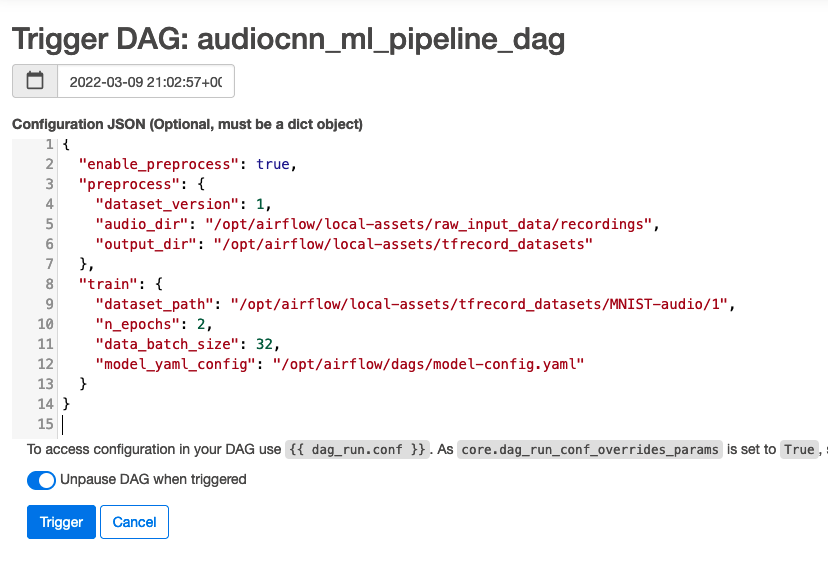
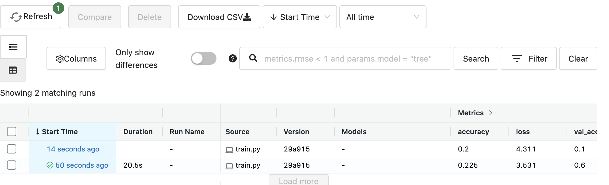
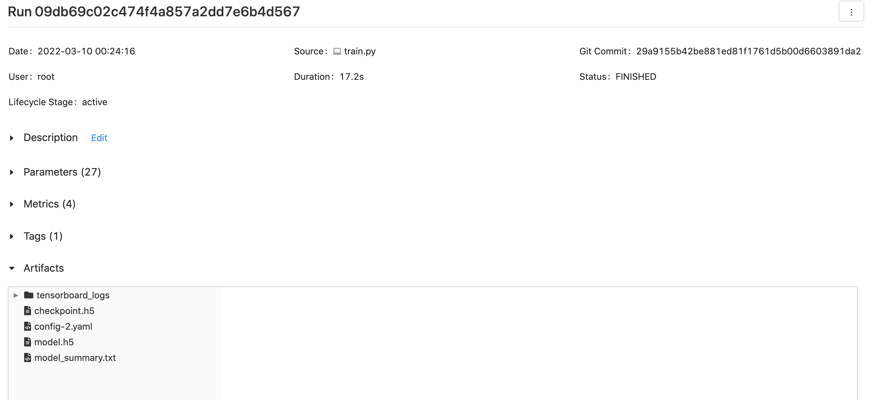
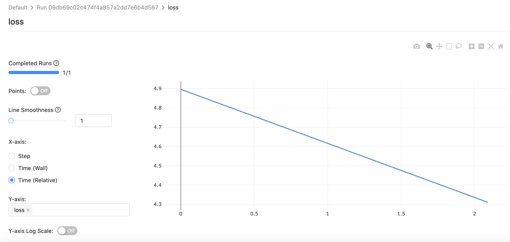

# ml-training-airflow-mlflow-example

Audio ML training job on Airflow with MlFlow experiment tracking.


This is an example of setting up local MLOPs training pipeline infrastructure with some dummy production ready ML research code on a local server.

> Note: This purely meant as an educational content for data scientists to get familiar with open-source tools like Airflow, MLFlow along with an example of packaing a custom python deep learning library.

> Note, this solution strictly considers the restrictions of local (on-premise) server setup using open-source technolgies. There are more alternatives if you are looking for cloud platform solutions. Also, the infrastructure setup here is not production-ready and soley meant for educational purpose.


The project is structured as below
- [audio_classifier](./audio_classifier): Custom python library for training deep learning audio classifiers. 
  Check [here](./audio_classifier/README.md) for more details.
- [dags](./dags): Custom Airflow DAGs and example json configurations to run ML pipeline
- [docker](./docker): Custom Dockerfiles for various containers used in our docker-compose stack.
- [env_files](./env_files): Files with environment variables defined for the docker-compose stack. (Note: dont use these secrets in production)
- [scripts](./scripts): A bunch of bash and python scripts along with some template configuration files.


## docker-compose stack


Tools used:

- Airflow: Tracking, Orchestration of DAG pipelines.
- MLFlow: Experiment tracking, versioning, model artfacts etc.
- Tensorflow, TF record, Essentia: Data processing, versioning and validation.
- Docker and compose: Containerisation all code and easy local development setup.
- Poetry: For better python dependency management of audio_classifier library.




> Note: You can also expand with stack with more custom containers with cpu or gpu support by extenting the tempalte docker-compose.yml file.

## Getting started 


- One command to spin up everything

```
docker-compose up --build airflow
```

> Your admin password passowrd of airflow UI can be accesed from the logs for first-time login

### Access dashboard

- MLFlow UI: http://localhost:5000
  
- Airflow UI: http://localhost:8080

>> Note: the login credentials for airflow are sent by email. PLease reachout if you haven't received it.

## Dataset

Make sure you download the dataset as per the instructions described [here](./data/README.md).


## Run DAG using Airflow

#### Using Airflow Web UI

- Go to http://localhost:8080



You will see a list of dags we predefined defined on the [./dags]() directory.


We can also see a visualisation of ML training pipeline DAG 




- Trigger our [ml_pipeline_dag.py](./dags/ml_pipeline_dag.py) using the 
  [ml_pipeline_config.json](./dags/ml_pipeline_config.json) example on the web UI.
  



## Experiment and model artifact tracking with MLFlow







## Local development Setup

- Launch our MLOps infrastructure with the following command 

```bash
docker-compose up --build mlflow
```

Once it is up you can access the web interfaces of both Airflow and MLFlow at the following addresses 

http://localhost:8080 and http://localhost:5000


> NOTE: For simplicity a reverse proxy wasn't added to the stack. But, a nginx server or similar could be added before deploying into a server


### Run your scripts from command line

Once the Airflow server is up run the following command

```bash
docker-compose run airflow bash
# once inside the shell
airflow trigger_dag 'example_dag_conf' -r 'run_id' --conf '{"message":"value"}'
```

#### Using only MLFlow Tracking

Once the MlFlow server is up run the following command

```bash
docker-compose run mlflow bash
# once inside the shell
python scripts/ml/train.py --help
```


## Things nice-to-have in future iterations

- Full fledge CI/CD pipeline on the repository
- More elaborate doc strings in python code of `audio_classifier`.
- Deploying Airflow more production ready mode (Now we are using SQLite backend for simplicity).
- Adding reverse-proxy (eg. nginx) for both remote MLFlow and Airflow tracking servers.


